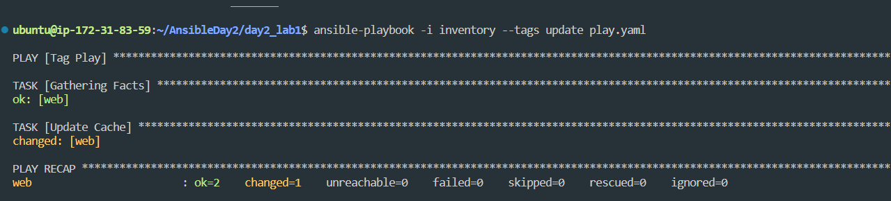

# Write simple playbook file
# Add two tasks (apt update – apt install nginx)
# Add tags to first task: update
# Add tags to second task: install
# Run only the (apt update) task
# Example: ansible-playbook my-playbook.yml --tags update
# Add one task with “tags: always” and run the previous command again

