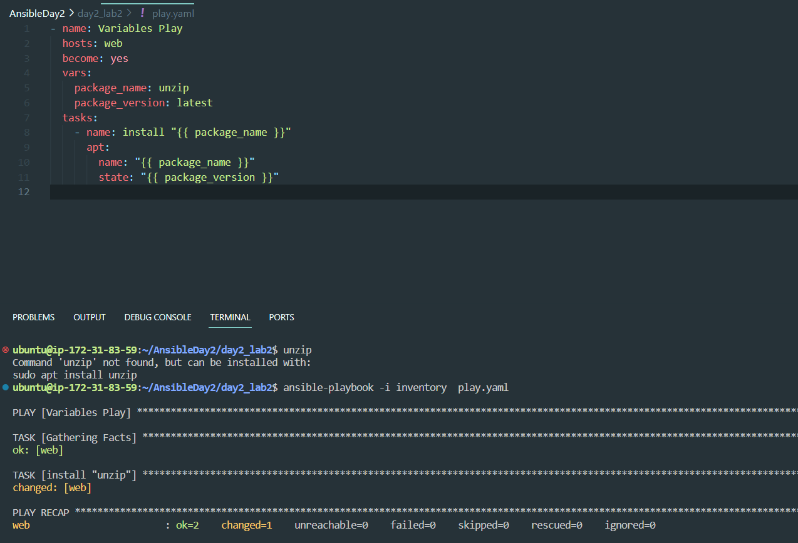
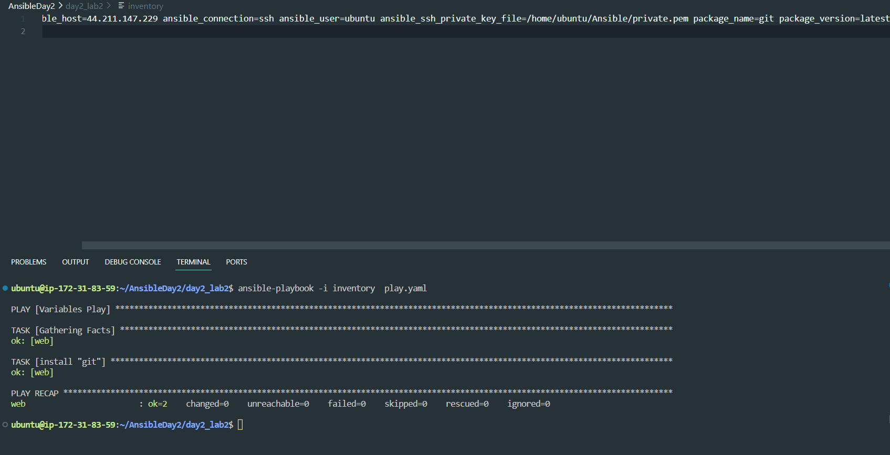
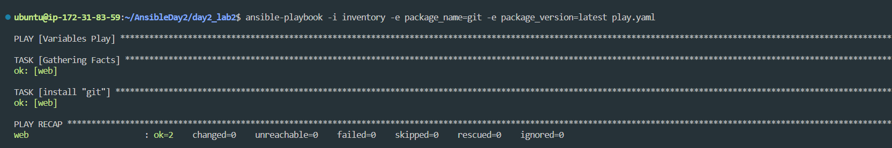

# Define these variables (package_name, package_version)
# on playbook level
# on inventory level
# on command line level
# Use apt module with the package name and version from your variables
Output #1:

Output #2:

Output #3:

